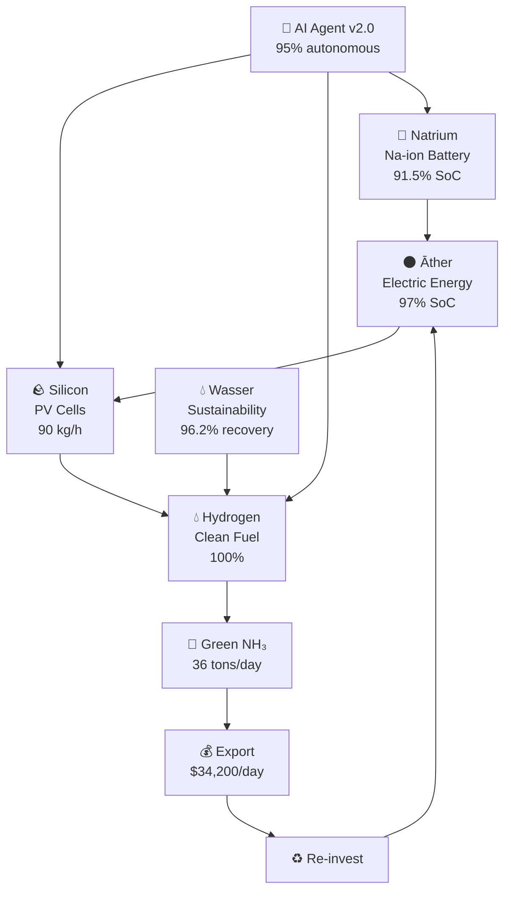

# The-Circular-Alchemist-DZ
<div align="center">


<br/><br/>

[](https://github.com/Ao_Anker-Intelligence-Lab)
[](https://github.com/Ao_Anker-Intelligence-Lab)
[](https://github.com/Ao_Anker-Intelligence-Lab)
[](https://github.com/Ao_Anker-Intelligence-Lab)
[](https://github.com/Ao_Anker-Intelligence-Lab)
[](https://github.com/Ao_Anker-Intelligence-Lab)

<br/>

> **"من رمال الصحراء إلى سيادة الطاقة"**
> *Vom Wüstensand zur Energiesouveränität • From Desert Sand to Energy Sovereignty*

**منظومة ذكاء اصطناعي متكاملة تحوّل التحديات المناخية لوادي سوف إلى فرص اقتصادية مستدامة**
ضمن رؤية **الجزائر الجديدة 2026** 🇩🇿

</div>

---

## 📋 Table of Contents / الفهرس

- [Overview](#-overview--نظرة-عامة)
- [Live Stats](#-live-stats--إحصائيات-حية)
- [The Circular Quintet](#️-the-circular-chemistry-quintet--الخماسي-الكيميائي)
- [ML Performance](#-ml-performance--أداء-الذكاء-الاصطناعي)
- [Na-ion Battery Innovation](#-na-ion-battery-innovation--ابتكار-البطاريات)
- [Green Ammonia Export](#-green-ammonia-export--تصدير-الأمونيا-الخضراء)
- [AI Agent v2.0](#-ai-agent-v20--المساعد-الذكي)
- [System Flow](#-system-flow--مسار-النظام)
- [Supported Regions](#-supported-regions--المناطق-المدعومة)
- [IP & Access Status](#-ip--access-status--الملكية-الفكرية-وحالة-الوصول)
- [SWOT Analysis](#-swot-analysis--التحليل-الاستراتيجي)
- [Partners & Collaboration](#-partners--الشركاء)

## 🧪 Overview / نظرة عامة

**The Circular Alchemist-DZ** is an autonomous AI-powered digital laboratory operating in **El Oued (Wadi Souf), Algeria** — one of the world's highest solar irradiance zones. The system integrates:

| Layer | Technology |
|-------|-----------|
| 🤖 **Intelligence** | Random Forest · XGBoost · Neural Networks · AI Agent v2.0 |
| ⚡ **Energy** | Solar PV (1040 W/m²) · Sodium-ion Storage · Green Hydrogen |
| ♻️ **Chemistry** | Circular Chemistry Quintet · Zero-Waste Feedback Loop |
| 🌿 **Output** | Green Ammonia (NH₃) · Export to European Markets |
| 🔄 **Control** | Live Feedback Loop · Real-time Decision Engine |

The system turns extreme desert conditions — 46°C heat, sandstorms, scarce water — into **competitive advantages**.

---

## 📊 Live Stats / إحصائيات حية

> *Recorded at El Oued | 46°C | Solar: 1040 W/m²*

```
┌─────────────┬──────────────┬────────────┬──────────────┬───────────────┐
│  Silicon    │  Hydrogen    │   Water    │    Āther     │    Natrium    │
│  90.0 kg/h  │   100% ⚡    │  95.1% 🌿  │  1079.7 kg   │  91.5% SoC   │
│   STABLE    │  Charging    │  539 Trees │    STABLE    │    Na-ion     │
└─────────────┴──────────────┴────────────┴──────────────┴───────────────┘
```

---

## ⚗️ The Circular Chemistry Quintet / الخماسي الكيميائي



| Element | العنصر | Role | Live Value |
|---------|--------|------|------------|
| 🌑 **Āther** | الأثير | Electrical energy + local storage | 97.0% SoC — STABLE |
| 🪨 **Silicon** | السيليكون | PV cells + electrolytic processing | 90.0 kg/h — STABLE |
| 💧 **Hydrogen** | الهيدروجين | Clean fuel → Green Ammonia | 100% — Charging |
| 💧 **Wasser** | الماء | Sustainability balance + recycling | 95.1% — 539 Trees |
| 🧂 **Natrium** | الصوديوم | Na-ion batteries + local storage | 91.5% SoC — Na-ion |

---

## 🤖 ML Performance / أداء الذكاء الاصطناعي

Benchmarked on **El Oued climate dataset** (temperature, solar irradiance, sandstorm index):

| Rank | Algorithm | R² Score | Status |
|------|-----------|----------|--------|
| 🥇 | **Random Forest** | **99.89%** | ✅ **Winner — Optimal** |
| 🥈 | XGBoost | 99.85% | ✅ Active |
| 🥉 | KNN | 99.77% | ✅ Active |
| 4 | Decision Tree | 99.76% | ✅ Active |
| 5 | Neural Network | 99.60% | ✅ Active |
| 6 | Linear Regression | 99.40% | ✅ Active |
| ❌ | SVM | **-30.49%** | ❌ Unsuitable — Extreme Conditions |

> **Why Random Forest wins**: Tree-based ensembles handle the non-linear climate interactions of Wadi Souf better than kernel methods. SVM collapses completely at desert-scale data variance.

---

## 🔋 Na-ion Battery Innovation / ابتكار البطاريات

> *Why sodium beats lithium in the Sahara*

```
Efficiency at 55°C (El Oued average summer temperature):

Lithium (Li-ion):  ████████████████████░░░░░░░░░░░░░░░░  45% ❌
Sodium (Na-ion):   ████████████████████████████████████  85% ✅

Difference: +40 percentage points at operating temperature
Source: Sahara salt lakes → free local raw material 🧂
```

| Metric | Na-ion | Li-ion |
|--------|--------|--------|
| Efficiency at 55°C | **85%** ✅ | 45% ❌ |
| Raw material source | Local desert salt | Imported |
| Cost vs. Li-ion | -30% | Reference |
| AI Boost | Active ✅ | N/A |
| Salt Cell integrity | **99.1%** | — |
| Overall efficiency | **92%** | ~60% at 55°C |

---

## 🌿 Green Ammonia Export / تصدير الأمونيا الخضراء

```
بوابة التصدير: الجزائر → ألمانيا / Algeria → Germany 🇩🇿 → 🇩🇪
```

| Metric | Value |
|--------|-------|
| Daily production | **36.0 tons NH₃/day** |
| Full market value | **$34,200 / day** |
| Export batch (Germany) | 5.20 tons → **$4,940** |
| CO₂ offset | **539 Trees** planted |
| Water recovery | **96.2%** Internal Recycling |
| Economic insight | Ship ammonia = **85% cheaper** than direct electricity export |
| Revenue uplift | **+$2,500** from ammonia conversion |

---

## 🔮 AI Agent v2.0 / المساعد الذكي

```json
{
  "Agent": "The Circular Alchemist-DZ",
  "Version": "2.0",
  "Mode": "Proactive",
  "Location": "El Oued (وادي سوف)",
  "Autonomy": "95%",
  "Status": "🔄 Running",
  "Water_Recovery": "95.1%",
  "Ammonia_Yield": "36.00 tons",
  "Battery_Decision": "Sodium Diversion",
  "Resource_Analysis": "Water Recovery: 95.1%"
}
```

**Decision capabilities:**
- **Āther Decision** — Smart resource balancing to ensure energy continuity and water conservation
- **Battery Decision** — AI-directed load routing to Na-ion thermal sweet spot (AI Boost active)
- **Export Decision** — Autonomous market assessment and Green NH₃ shipping batch optimization
- **Sandstorm Mode** — Emergency protocol: automatic system protection and efficiency rerouting

---

## 🏗️ System Architecture / هيكل النظام

```mermaid
graph TD
    %% User Layer
    A[🖥️ Interactive Streamlit Dashboard] --> B[⚙️ Core Simulation Engine]

    %% Intelligence Layer
    subgraph Intelligence & Processing Core
        B --> C[🤖 ML Engine: Random Forest Benchmark]
        B --> D[🔋 Na-ion Thermal Battery Manager]
        B --> E[🌿 Green Ammonia Export Gateway]
    end

    %% Autonomous Control
    C & D & E --> F[🔮 AI Agent v2.0 Decision Loop]

    %% Real-time Outputs
    F --> G[📊 Live Performance Metrics & Export Analytics]

---

## 📍 Supported Regions / المناطق المدعومة

| Region | المنطقة | Specialty | Status |
|--------|---------|-----------|--------|
| 🟠 El Oued (Wadi Souf) | وادي سوف | Desert solar — primary hub | ✅ Active |
| 💙 El Bayadh | الأبيض سيدي الشيخ | Wind energy + pastoral | 🔄 Dev |
| 🟢 Sig - Mascara | سيق - معسكر | Smart agriculture | 🔄 Dev |
| 🦬 Béchar | بشار | Deep desert exploration | 📋 Planned |
| 🌿 El Menia | المنيعة | Oasis sustainability model | 📋 Planned |
| 🍎 Naâma | النعامة | Forest + biodiversity | 📋 Planned |

---

## 🔒 IP & Access Status / حالة الوصول والملكية الفكرية

> ⚠️ **Restricted Repository Notice:** This repository contains proprietary machine learning algorithms, chemical simulation engines, and trade logistics code developed under **Ao_Anker Intelligence Lab**.

### Deployment & Evaluation
- **Source Code Status:** Private & Proprietary (Access restricted).
- **Live Demo & Pilot Access:** Available for institutional partners, research investors, and government stakeholders upon request under Non-Disclosure Agreements (NDA).
- **Environment Stack:** Built on Python 3.10+, Streamlit Enterprise, Scikit-learn, and XGBoost core backends.

> 📩 **Request Access:** To request a private pilot demonstration or institutional integration, please contact **Ao_Anker Intelligence Lab** via [LinkedIn](https://linkedin.com) or open an inquiry in the [Issues Section](https://github.com/Ao_Anker-Intelligence-Lab/circular-alchemist-dz/issues).

## 📊 SWOT Analysis / التحليل الاستراتيجي

| | Strengths 💪 | Weaknesses ⚠️ |
|--|-------------|----------------|
| | ML accuracy 99.89% (Random Forest) | Extreme heat: logistical challenges |
| | Zero-waste circular system | High initial infrastructure cost |
| | Na-ion batteries from local salt | Specialized technical skills required |
| | AI Agent v2.0 (95% autonomous) | |

| | Opportunities 🚀 | Risks ⚡ |
|--|-----------------|---------|
| | Export to Germany (LeineEnergie) | Regulatory and competitive challenges |
| | New Algeria 2026 vision | Global energy price volatility |
| | Growing green hydrogen market | Sandstorm equipment risk |
| | European clean energy demand | |

---

## 🤝 About / عن المشروع

| | |
|--|--|
| **Developer** | Ao Anker Intelligence Lab |
| **Based in** | 🇩🇪 Germany |
| **Built for** | 🇩🇿 Algeria — El Oued (Wadi Souf) |
| **Vision** | الجزائر الجديدة 2026 |

> 🌍 **Open to collaboration** — Das Projekt richtet sich an Algerien, ist aber offen für europäische und deutsche Partnerschaften im Bereich grüner Wasserstoff und erneuerbarer Energien.
> 
> المشروع مبني من أجل الجزائر، وأوروبا — خاصة ألمانيا — مهتمة بالطاقة الخضراء. نرحب بأي شراكة مستقبلية.

---

## 📄 License

This project is protected under a **Proprietary License**.
Unauthorized use, reproduction, or distribution is prohibited.

© 2026 **The Circular Alchemist-DZ** | **Ao Anker Intelligence Lab**

---

<div align="center">

**🌍 Built for Algeria. Designed for the Future. 🇩🇿**

*رمالنا + شمسنا + ذكاؤنا = مستقبل مشرق*
*Unser Sand + unsere Sonne + unsere KI = eine strahlende Zukunft*


</div>
